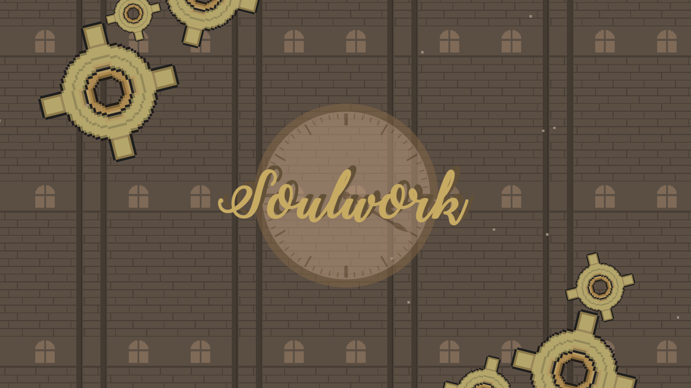

# Soulwork

## About

This project is a Unity Project for a Game Jam \@ MacEwan from November 8-10, 2019. You must complete it in 48 hours with a group. You must also have fun.

Topic: Clockwork

## Description

It is a platformer involving ghosts. You control the player (robot) with the arrow keys or the a, d, w keys. 

## Story

Joe broke the clock. Now it's your job as a robot mechanic to fix the **Clock of Causality**. 
Thanks to Joe, the "wibbly-wobbly, timey-wimey stuff" effect of the space-time continuum has caused your robot soul 
to be seperated from the motherboard, creating a daul version of yourself that is able to interact with things. 
The **Clock of Causality** upholds the space-time continuum and if you do not fix the clock soon, "everyone dies, the end".

TL;DR

Something "wibbly-wobbly, timey-wimey stuff" happened and you must collect all 12 pieces to fix the **Clock of Causality**.

## Controls

* Use A, W, D keys or Left, Right, Up arrow key (or both) to move
* There is a long and a short jump depending on how long you press the jump button
* Space key for **"soul jumping"**

## Licence

The rules for copy and distributing this project licence are
outlined in the licence.txt file.

This project is under an MIT licence

## Engine used

* Unity
